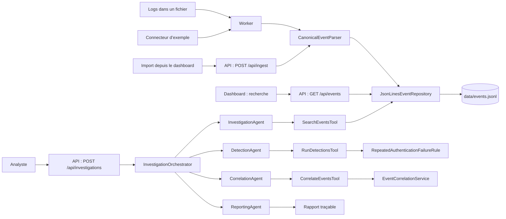
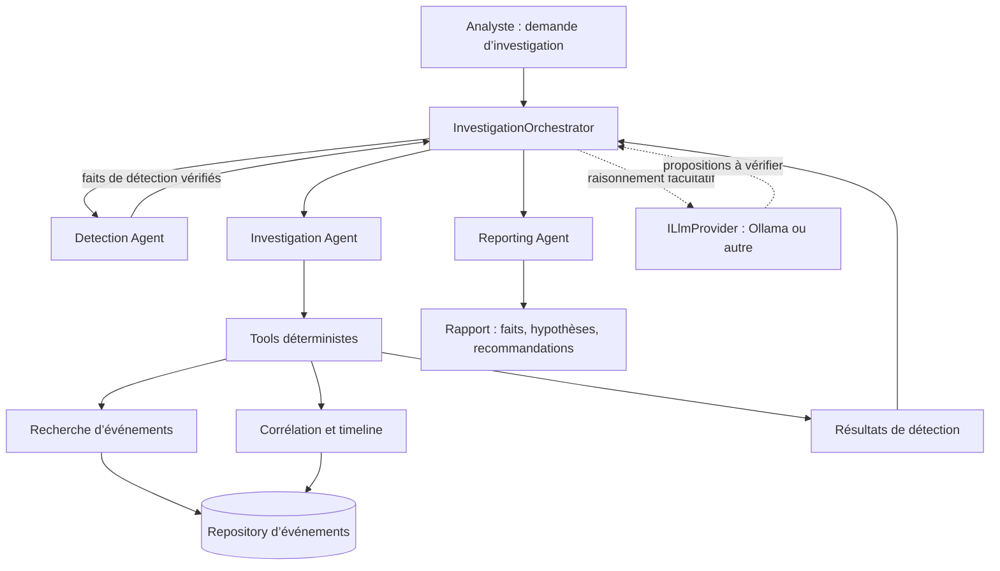

# Cartographie de l’application et du système agentique

État du dépôt au 25 septembre 2026. L’orchestrateur décrit ci-dessous est maintenant exécutable sans LLM.

## Ce qui s’exécute aujourd’hui

Le parseur prend en charge les lignes pipe à sept champs et les lignes `timestamp LEVEL [component] message`. Le dépôt JSONL persiste les événements normalisés. Le dashboard et le worker utilisent ce moteur déterministe.

## Où se trouve l’agentique aujourd’hui ?

Le runtime est dans `packages/agentic/AgenticLogAnalyzer.Agentic`. L’API l’enregistre dans son conteneur DI et expose `POST /api/investigations`; le bouton **Investiguer** du dashboard l’appelle. L’orchestration est séquentielle et déterministe. Aucun LLM n’est appelé.

| Élément | Emplacement | État réel |
|---|---|---|
| Élément | Emplacement | État réel |
|---|---|---|
| InvestigationOrchestrator | `packages/agentic/.../InvestigationOrchestrator.cs` | Enchaîne les agents, transmet l’annulation et assemble un rapport. |
| Investigation Agent | `packages/agentic/.../Agents.cs` | Recherche jusqu’à 1 000 événements via `SearchEventsTool`. |
| Detection Agent | `packages/agentic/.../Agents.cs` | Exécute les règles enregistrées ; la règle initiale cible trois échecs d’authentification en dix minutes. |
| Correlation Agent | `packages/agentic/.../Agents.cs` | Relie les événements partageant un utilisateur, une IP source ou un appareil. |
| Reporting Agent | `packages/agentic/.../Agents.cs` | Émet faits, hypothèses, recommandations et références vers les événements. |
| Tools | `packages/agentic/.../InvestigationTools.cs` | Recherche bornée, exécution des détections et corrélation. |
| API | `POST /api/investigations` | Lance l’orchestrateur avec `query` facultatif et `maxEvents`. |
| Dashboard | Bouton **Investiguer** | Affiche détections, corrélations, hypothèses, recommandations et trace d’agents. |
| Contrat et fournisseur LLM | `ILlmProvider`, `OllamaLlmProvider` | Contrat présent ; Ollama n’est pas implémenté et n’est pas utilisé. |

Les rôles dans `agents/*/AGENT.md` restent des consignes de conception ; les classes C# du runtime sont les composants qui s’exécutent.

## Prochaine étape : étendre le runtime

### Responsabilités actuelles et limites

- **Orchestrateur** : exécute les quatre étapes dans un ordre fixe et renvoie leur trace. Il ne conserve pas encore les rapports en base.
- **Detection Agent** : expose une règle initiale pour les échecs d’authentification répétés ; les autres familles de détection restent à ajouter.
- **Investigation Agent** : recherche par texte et limite le volume d’événements ; il n’accepte pas encore des filtres temporels ou des identifiants d’alerte dédiés.
- **Correlation Agent** : groupe par utilisateur, IP source et appareil. Les groupes sont des liens de co-occurrence et ne prouvent pas à eux seuls une causalité.
- **Reporting Agent** : distingue les faits de détection des hypothèses et rattache les deux aux IDs d’événements.
- **LLM** : n’est pas appelé ; Ollama doit être implémenté avant toute activation.

### Ordre d’implémentation recommandé

1. Étendre les règles de détection et les corrélations avec des tests sur des fixtures anonymisées.
2. Ajouter filtres temporels et investigation par identifiant de détection.
3. Persister les rapports et traces d’exécution pour audit.
4. Implémenter Ollama comme fournisseur facultatif, avec contrôle de chaque affirmation contre les tool results.

Cette séquence suit le contrat du dépôt : le moteur déterministe reste opérationnel même si Ollama ou un autre LLM est arrêté.
